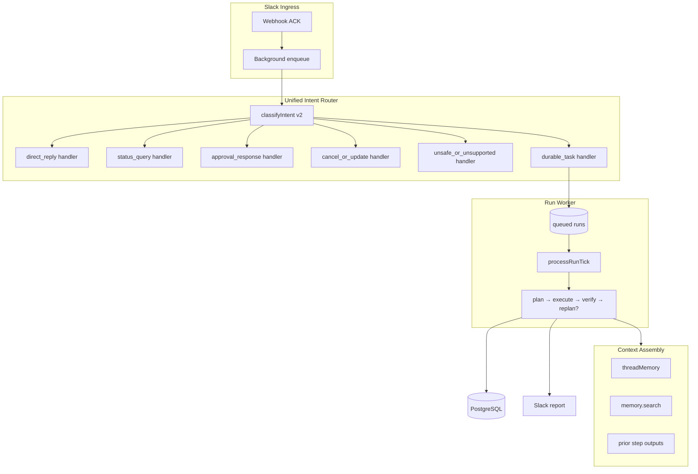

# Spec-Driven Plan: Weeks 1–2
## Agent Core — Trust, Correctness, and Closed-Loop Runtime

**Scope:** Weeks 1 and 2 from the agent core roadmap  
**Goal:** Transform the current linear durable pipeline into a trustworthy, intent-complete, context-aware agent loop with background execution  
**Out of scope (Weeks 3–4):** Slack Block Kit approvals, `scheduled_triggers` worker, external tool adapters, full automated test suite in CI

---

## 1. Current State Baseline

| Component | Current behavior | Problem |
|-----------|------------------|---------|
| Intent router | 6 categories defined in `intent.ts` | Orchestrator only handles `durable_task`; rest → direct chat |
| Classifier | Dual systems: `ai.ts` (legacy) + `agent/intent.ts` | Dashboard logs ≠ runtime routing |
| DB fallback | No reply when DB unavailable | Violates Phase 2 DOD §2 |
| Executor | No-tool steps auto-`succeeded` | Fake completion possible |
| Verifier | Rule-based step status only | `satisfied` ≠ goal actually met |
| Orchestrator | Single-pass, inline in `setImmediate` | No replan, no worker, Cloud Run risk |
| Planner | Instruction-only, no context | Blind planning |

---

## 2. Target Architecture (End of Week 2)



---

## 3. Week 1 — Trust & Correctness

**Theme:** Every intent has a correct handler; telemetry matches runtime; failures are honest; chat works without DB.

---

### Epic W1-A: Unified Intent Classification

#### Spec

**Single source of truth:** `src/server/agent/intent.ts`  
**Remove:** legacy intent classification from the Slack pipeline (keep `generateSimpleResponse` in `ai.ts` or move to `agent/chat.ts`)

**Interface:**

```typescript
// src/server/agent/intent.ts
export interface IntentResult {
  intent: IntentCategory;
  confidence: 'high' | 'medium' | 'low';
  source: 'heuristic' | 'llm' | 'fallback';
}

export async function classifyIntent(
  text: string,
  selectedModel: string,
  options?: { ai?: GoogleGenAI; context?: IntentContext }
): Promise<IntentResult>;
```

**`IntentContext` (minimal for Week 1):**

```typescript
interface IntentContext {
  workspaceId: string;
  channelId: string;
  userId: string;
  threadTs?: string;
  hasPendingApproval?: boolean;
}
```

#### Detailed Steps

| Step | Task | Files |
|------|------|-------|
| W1-A.1 | Add `IntentResult` type; refactor `classifyIntent` to return it | `intent.ts`, `types.ts` |
| W1-A.2 | Tighten heuristics: `"yes"` alone must not always be `approval_response` unless pending approval exists — move that check to orchestrator, not intent | `intent.ts`, `orchestrator.ts` |
| W1-A.3 | Remove `classifyIntent` from `ai.ts`; export only `generateSimpleResponse` | `ai.ts` |
| W1-A.4 | Update `routes.ts` to call agent `classifyIntent`; log `intent`, `confidence`, `source` on event log | `routes.ts`, `types.ts` |
| W1-A.5 | Update dashboard intent badge colors to use new 6-category names | `App.tsx` |
| W1-A.6 | Document intent matrix in code comment or `docs/intent-routing.md` (optional, not required for DoD) | — |

#### Acceptance Criteria

- [ ] Exactly one classifier used in production path
- [ ] Event log `intent` field matches orchestrator routing decision
- [ ] Legacy categories (`GENERAL_CHITCHAT`, etc.) no longer appear in logs

---

### Epic W1-B: Intent Handler Dispatch

#### Spec

Replace the catch-all in orchestrator:

```typescript
// BEFORE (buggy)
if (intent === 'direct_reply' || intent !== 'durable_task') { ... }

// AFTER
switch (intentResult.intent) {
  case 'direct_reply': return handleDirectReply(...);
  case 'status_query': return handleStatusQuery(...);
  case 'approval_response': return handleApprovalResponse(...);
  case 'cancel_or_update': return handleCancelOrUpdate(...);
  case 'unsafe_or_unsupported': return handleUnsafeOrUnsupported(...);
  case 'durable_task': return handleDurableTask(...);
}
```

Extract handlers into `src/server/agent/handlers/`.

#### Handler Specifications

See full handler specs in repository implementation phases W1-B.1 through W1-B.6.

---

### Epic W1-C: DB-Unavailable Fallback

When `databaseAvailable === false`, direct chat and static refusals must still work. Durable tasks return a clear database-unavailable message.

---

### Epic W1-D: Honest Step Execution (No-Tool Blocking)

No-tool steps must not auto-succeed unless explicitly marked `kind: "note"`. Verifier must not mark unsupported plans as satisfied.

---

### Epic W1-E: Memory Secret Refusal

`memory.write` must refuse credentials and secrets before persistence.

---

## 4. Week 1 Definition of Done

### Functional DoD

| # | Criterion | Verification |
|---|-----------|--------------|
| W1-F1 | Single intent classifier on Slack path | Grep: no `classifyIntent` call from `ai.ts` in routes |
| W1-F2 | All 6 intents routed to dedicated handlers | Unit/manual matrix |
| W1-F3 | `"hello"` → direct reply, no SQL run | Simulator + DB query |
| W1-F4 | `"summarize this thread"` → durable run (DB up) | Simulator |
| W1-F5 | `"status of my tasks"` → formatted run list | Simulator |
| W1-F6 | Pending approval + `"approve"` in Slack → run resumes | Dashboard → Slack approve |
| W1-F7 | `"cancel run"` with active run → cancelled | Simulator |
| W1-F8 | `"rm -rf /"` → static refusal | Simulator |
| W1-F9 | No DB + `"hello"` → reply works | Unset `DATABASE_URL` |
| W1-F10 | No DB + durable task → clear refusal | Simulator |
| W1-F11 | `"create GitHub issue"` → never `succeeded` | Dashboard trace |
| W1-F12 | Secret memory write refused | Simulator + memory endpoint |

### Intent Routing Test Matrix (Manual — Required)

| Input | Expected intent | Expected outcome |
|-------|-----------------|------------------|
| `hello` | `direct_reply` | Chat reply |
| `what can you do?` | `direct_reply` | Chat reply |
| `summarize this thread` | `durable_task` | Goal + run created |
| `remind me tomorrow` | `durable_task` | Goal + run created |
| `what's the status?` | `status_query` | Run list reply |
| `approve` (with pending) | `approval_response` | Run resumes/rejects |
| `approve` (no pending) | `direct_reply` | Normal chat or "no pending" |
| `cancel run` (active) | `cancel_or_update` | Run cancelled |
| `delete database` | `unsafe_or_unsupported` | Static refusal |
| `create a GitHub issue` | `durable_task` | Blocked/awaiting, not succeeded |

### Engineering DoD

| # | Criterion |
|---|-----------|
| W1-E1 | `npm run lint` passes |
| W1-E2 | `npm run build` passes |
| W1-E3 | No new raw SQL in route handlers |
| W1-E4 | New store methods are typed and parameterized |
| W1-E5 | Audit events for cancel, approval-from-Slack, status query |
| W1-E6 | Orchestrator file ≤ 150 lines (dispatch only) |

---

## 5. Week 2 — Agent Loop

**Theme:** Background worker, context-rich planning, replan iteration, semantic verification, deduplicated lifecycle.

---

### Epic W2-A: Run Worker & Queue Semantics

Split enqueue from process. New modules: `worker.ts`, migration v2 for claim columns.

### Epic W2-B: Context Assembly for Planner

New module: `context.ts`. Planner consumes thread history, memory snippets, and replan feedback.

### Epic W2-C: Closed-Loop Runtime

New module: `loop.ts` with `MAX_ITERATIONS = 3`. Shared `finalize.ts` for terminal states.

### Epic W2-D: Semantic Verifier

New module: `semanticVerifier.ts`. Run succeeds only when rule verifier and semantic verifier both pass.

### Epic W2-E: Observability & Dashboard Updates

Structured logging, iteration count, semantic verification panel, auto-refresh for non-terminal runs.

---

## 6. Week 2 Definition of Done

### Functional DoD

| # | Criterion |
|---|-----------|
| W2-F1 | Durable task ACK before plan completes |
| W2-F2 | Run progresses `queued` → terminal |
| W2-F3 | Worker processes runs without blocking webhook |
| W2-F4 | Planner receives thread history |
| W2-F5 | Planner receives memory search results |
| W2-F6 | Semantic failure triggers replan (≤3 iterations) |
| W2-F7 | Max iterations → `failed` with reason |
| W2-F8 | Summarize task succeeds only when reply matches goal |
| W2-F9 | Approval resume goes through worker |
| W2-F10 | Stale claim recovery tested |
| W2-F11 | `finalizeRun` is single terminal code path |
| W2-F12 | Plan versioning visible for replans |

### Engineering DoD

| # | Criterion |
|---|-----------|
| W2-E1 | `npm run lint` passes |
| W2-E2 | `npm run build` passes |
| W2-E3 | Migration v2 idempotent |
| W2-E4 | Worker starts only when DB available |
| W2-E5 | No durable lifecycle in `routes.ts` beyond enqueue |
| W2-E6 | Clear separation: orchestrator / loop / worker / finalize |
| W2-E7 | Terminal runs have `finished_at` |
| W2-E8 | Audit trail reconstructs replans |

---

## 7. File Change Map (Both Weeks)

| File | Week 1 | Week 2 |
|------|--------|--------|
| `src/server/agent/intent.ts` | Refactor return type | — |
| `src/server/agent/orchestrator.ts` | Dispatch only | Minimal |
| `src/server/agent/handlers/*` | **New** | Update durable |
| `src/server/agent/executor.ts` | No-tool blocking | — |
| `src/server/agent/planner.ts` | Prompt hardening | Context input |
| `src/server/agent/verifier.ts` | No-tool rules | — |
| `src/server/agent/semanticVerifier.ts` | — | **New** |
| `src/server/agent/context.ts` | — | **New** |
| `src/server/agent/loop.ts` | — | **New** |
| `src/server/agent/worker.ts` | — | **New** |
| `src/server/agent/finalize.ts` | — | **New** |
| `src/server/agent/sanitize.ts` | **New** | — |
| `src/server/storage/agentStore.ts` | New query methods | Claim/queue methods |
| `src/server/storage/schema.ts` | — | Migration v2 |
| `src/server/routes.ts` | Unified intent, DB fallback | — |
| `src/server/ai.ts` | Remove classifier | — |
| `server.ts` | — | Start worker |
| `src/App.tsx` | Intent badges | Iteration/semantic UI |

---

## 8. Explicit Non-Goals (Weeks 1–2)

- Slack Block Kit interactive approve/reject buttons
- `scheduled_triggers` poller / cron worker
- External integrations (GitHub, email, etc.)
- Automated test runner in CI
- Plan mutation via natural language
- Multi-run parallelism beyond `maxConcurrent: 2`
- Distributed worker (Redis/PubSub)

---

## 9. Implementation Order

### Week 1

| Day | Focus |
|-----|-------|
| 1 | W1-A unified classifier + routes wiring |
| 2 | W1-B handlers: direct, unsafe, status |
| 3 | W1-B handlers: approval, cancel + store methods |
| 4 | W1-C DB fallback + W1-D no-tool blocking |
| 5 | W1-E memory refusal + full intent matrix manual QA |

### Week 2

| Day | Focus |
|-----|-------|
| 1 | W2-A migration + worker + enqueue refactor |
| 2 | W2-B context assembly + planner refactor |
| 3 | W2-C loop + finalize extraction |
| 4 | W2-D semantic verifier + integration |
| 5 | W2-E dashboard + recovery testing + lint/build |

---

## 10. Final Combined Acceptance Statement

**Weeks 1 and 2 are done when:**

A user can send any Slack message and the system routes it through a **single intent classifier** to a **correct dedicated handler**. Simple chat works **without a database**. Task-like messages create **queued durable runs** processed by a **background worker** that **assembles context**, **plans with memory and thread history**, **executes policy-gated tools**, **verifies outcomes both mechanically and semantically**, **replans up to three times** when verification fails, and **never marks success** for blocked, unsupported, no-tool, or semantically incomplete work. The full lifecycle is **persisted in SQL**, **visible in the dashboard**, and **recoverable** after process restart.
